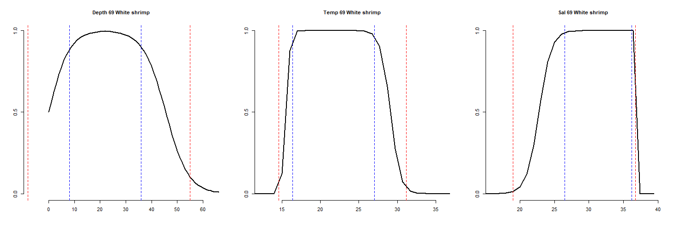

# Make Ecospace Environmental Preference Functions
This code queries the Aquamaps database and, with further processing, we generate environmental preference functions for the Gulf-wide Ecospace Model. 

Data to make these preference functions comes from the [AquaMaps](https://www.aquamaps.org/main/AboutAquaMaps.php), a tool for generating model-based, large-scale predictions of natural occurrences of species. To date, AquaMaps has standardized distribution maps for over 17,300 species of fishes, marine mammals, and invertebrates. This is done by combining occurrence records along with expert knowledge and environmental data to compensate for biases and gaps in existing occurrence data sets.

Estimates of species preferences, called environmental envelopes, are derived from large sets of occurrence data available from online collection databases such as GBIF (www.gbif.org) and OBIS (www.iobis.org), FishBase (and in SeaLifeBase and AlgaeBase for non-fish), and  from the literature for a given species and its habitat usage. The AquaMaps modeling process involves constructing environmental envelopes that describe a species' habitat usage in relation to various environmental parameters. AquaMaps provides an expert review process to improve the accuracy of the predictions by incorporating additional knowledge and adjusting envelope settings. The environmental envelopes are matched against local environmental conditions to determine the suitability of a given area in the ocean for a particular species. Environmental envelopes for each species, along with the associated species input parameters, are stored in a corresponding Species Environmental Envelope File (HSPEN). Species are assigned identification codes according to the [2018 Annual Checklist Catalogue of Life](https://www.catalogueoflife.org/annual-checklist/2018/).

For the USGWEM, we develop environmental preference functions for **depth**, **temperature**, and **salinity**. Preferences for each environmental driver are parameterized with values for absolute and preferred minima and maxima: 
1. Min<sub>abs</sub>  = absolute minimum in extracted data or 25th percentile - 1.5 × interquartile (whichever is lesser)
2. Min<sub>pref</sub> = 10th percentile of observed variation in an environmental predictor
3. Max<sub>pref</sub> = 90th percentile of observed variation in an environmental predictor
4. Max<sub>abs</sub>  = absolute maximum in extracted data or 75th percentile + 1.5 × interquartile (whichever is greater)

### References for Aquamaps
- Elith, J., C. H. Graham, et al. (2006). "Novel methods improve prediction of species' distributions from occurrence data." Ecography 29: 129-151.
- Guisan, A. and N. Zimmermann (2000). "Predictive habitat distribution models in ecology." Ecological Modelling 135: 147-186.
- Kaschner, K., L. B. Christensen, et al. (2006). Mapping top consumers in marine ecosystems past and present: comparative consumption rates of great whales and fisheries (SC/58/E3). International Whaling Commission - Scientific Committee Meeting, (unpublished).
- Kaschner, K., R. Watson, et al. (2006). "Mapping worldwide distributions of marine mammals using a Relative Environmental Suitability (RES) model." Marine Ecology Progress Series 316: 285-310.
- Moisen, G. G. and T. S. Frescino (2002). "Comparing five modelling techniques for predicting forest characteristics." Ecological Modelling 157(2-3): 209-225.

# Query data from Aquamaps: 1-Query-env-prefs.R
1. **Setup.** If this is an initial run, you'll need to setup the [Aquamaps Package](https://raquamaps.github.io/aquamapsdata/articles/intro.html):
   - Install the `aquamapsdata` package from GitHub using `remotes::install_github()`.
   - Download the Aquamaps database locally using `download_db(force = TRUE)`.
   - Set the default database to SQLite using `default_db("sqlite")`.
   - Additional library dependencies: `dplyr` and `stringr`

2. **QA/QC Species List and Get Aquamaps Keys.**
   - First, read in the species list from a CSV file. 
   - Define genus and species names. Filter out rows without species names: `fg <- fg %>% filter(!is.na(Species)); nrow(fg)`
   - Periods in the scientific names (`fg$Sciname`) seem to break `am_search_fuzzy`. Also, filter out all rows where 'sp', 'sp.','spp','spp.' etc. are included.
     ```R
     rm_ls <- paste(c('spp.','sp.','spp', 'sp.', '-', '#', "/", "<", ">", "0", ","), collapse = '|')
     fg <- fg %>% filter(!grepl(rm_ls, Sciname)); nrow(fg)
     ```
   - Query the Aquamaps database with `am_search_fuzzy` to get species keys for each species.
     ```R
     for (i in 1:nrow(fg)){
      fg$Key[i] <- paste(am_search_fuzzy(fg$Sciname[i]) %>% pull(key) %>% as.array(), collapse = ' | ')
     }
     ```
   - Perform QA/QC checks to remove unwanted characters and duplicated rows. Also remove rows without keys or with duplicate keys
   - Write out the QA/QC species list with Aquamaps keys to a CSV file in "./global-data/".

3. **Query HSPEN Environmental Preferences.** 
   - First, make a long dataframe `long_fg` with a unique key for each species.
     ```R 
     for (i in 1:nrow(fg)) {
        #i = 4
        row = fg[i, ]
        key_ls  <- as.list(scan(text=fg$Key[i], what=""))
        key_ls  <- key_ls[key_ls != "|"]
        row$Key <- NULL
        row     <- row %>% slice(rep(1:n(), each = length(key_ls)))
        key_df  <- do.call(rbind.data.frame, key_ls)
        names(key_df) <- "Key"
        row     <- cbind(row, key_df)
        long_fg <- rbind(long_fg, row)
      }
     ```    
   - Query the HSPEN environmental preferences for each species from the Aquamaps database.
     ```R
        for (i in 1:nrow(long_fg)) {
          key <- long_fg$Key[i]
          prf <- am_hspen() %>% filter(SpeciesID == key) ## Query preferences from aquamaps
          prf <- prf %>% 
            select(LifeStage,   Pelagic,
                   DepthMin,    DepthPrefMin,    DepthPrefMax,    DepthMax,
                   TempMin,     TempPrefMin,     TempPrefMax,     TempMax,
                   SalinityMin, SalinityPrefMin, SalinityPrefMax, SalinityMax,
                   PrimProdMin, PrimProdPrefMin, PrimProdPrefMax, PrimProdPrefMax,
                   OxyMin,      OxyPrefMin,      OxyPrefMax,      OxyMax,
                   LandDistMin, LandDistPrefMin, LandDistPrefMax, LandDistMax,
                   NMostLat,    SMostLat,        WMostLong,       EMostLong)
          long_pref <- rbind(long_pref, cbind(long_fg[i ,], prf))
        }
        ```
   - Some species have multiple entries. Without information to differentiate them, I've decided to average them. Merge the preferences with the species list by species ID.
   - Finally, we aggregate the preferences by Ecospace functional groups, calculating the mean and count of preferences for each group.
   - Write out the preference parameters for each functional group in a CSV file.

# 2-Make-env-pref-matrices for Ecospace
### `doublelogistic`
The **`doublelogistic`** function generates a double logistic curve representing the preference of a species for a specific environmental parameter based on given absolute and preferred minimums and maiximums. Arguments:
- `max`: Maximum value of the environmental parameter.
- `steps`: Number of steps to divide the curve.
- `range`: Range type ('wide' or 'nar').
- `min_abs`: Min<sub>abs</sub> value of the environmental parameter.
- `min_prf`: Min<sub>pref</sub> value of the environmental parameter.
- `max_prf`: Max<sub>pref</sub> value of the environmental parameter.
- `max_abs`: Max<sub>abs</sub> value of the environmental parameter.
- `range`: Range type ('wide' or 'nar'). Determines how the curve is shaped inversely proportional to range size. If range is set to `range == wide`, then the `B` parameter is set to `1/sqrt(range)`. If `range == nar`, then `B = 1 / log10(range)`.

```R
doublelogistic <- function(max = 400, steps = 400, range = 'wide', min_abs, min_prf, max_prf, max_abs){ 
  mid_prf <- min_prf + (max_prf - min_prf) / 2 ## Midpoint. Change from increasing to decreasing logistic function
  mid <- ifelse(mid_prf > max, max, mid_prf)
  step_size <-  max / steps
  x1  <- seq(0, mid-step_size, by = step_size)
  x2  <- seq(mid, max, by = step_size)
  r1  <- min_prf - min_abs 
  r2  <- max_abs - max_prf 
  C1  <- min_abs + r1 / 2
  C2  <- max_prf + r2 / 2
  B1  <- ifelse(range == 'wide', 1/sqrt(r1), 1/log10(r1)) ## If range is 'wide', curve shape inversely proportional to range size
  B2  <- ifelse(range == 'wide', 1/sqrt(r2), 1/log10(r2))
  if(B1 < 0) B1 = Inf
  if(B2 < 0) B2 = Inf
  S  = 1; A1 = 0; D1 = 1; A2 = 1
  ## Logistic equations
  f1 <- function(x)     1 / (1 + exp(B1*(C1-x)))^S ## Increasing logistic eq.
  f2 <- function(x) 1 - 1 / (1 + exp(B2*(C2-x)))^S ## Decreasing logistic eq.
  y1 <- f1(x1)
  y2 <- f2(x2)
  out <- data.frame(x = c(x1, x2), y = c(y1, y2))
  out <- out[1:steps, ] 
  return(out)
}
```

The two logistic equations in the double logistic function are as follows:

$$
\begin{equation}
f_1(x) =\frac{1}{\left(1 + e^{B_1 C_1}\cdot e^{-B_1 x}\right)^{S}} \quad \text{(Increasing logistic eq. where x < midpoint)}
\end{equation}
$$

$$
\begin{equation}
f_2(x) = 1 - \frac{1}{\left(1 + e^{B_2 C_2}\cdot e^{-B_2 x}\right)^{S}} \quad \text{(Decreasing logistic eq. where x >= midpoint)}
\end{equation}
$$

- Where 1 is the value of the horizontal asymptote when x→−∞ and 0 is the value of the horizontal asymptote when x→+∞
- The 'B' parameters, `B1` and `B2`, describe how rapidly the curve makes its transition between the two asymptotes. We set these to be inversely proportional to the range between the preferred minimum and maximum values. The transition speed is further modified by the user setting the range to `range==nar` or `range==wide`. When set to `wide`, B = 1/**sqrt**(Max<sub>pref</sub> - Min<sub>pref</sub>). When set to `nar`, B = 1/**log10**(Max<sub>pref</sub> - Min<sub>pref</sub>). The latter makes for a faster transition between asymptotes. 
- `S` describes the asymmetry of the curve. (The curve is symmetric when S = 1.) `C` is a location parameter, which does not have a nice interpretation unless S=1 whereby the curve has an inflection point at x = C. We set S=1 for simplicity. In this case, C = the value of x for which f(x) is the midpoint between the two asymptotes.

### `plot_pref_func`
`plot_pref_func` function plots the preference function curve generated by the doublelogistic function. It takes the following arguments:
- `driver` represents the environmental driver (for the USGWEM: depth, temperature, or salinity).
- `p1`, `p2`, `p3`, and `p4` correspond to and are informed by `min_abs`, `min_pref`, `max_pref`, and `min_abs`, respectively. 
- `fg_num` is the EwE number of the species and `fg_name` represents the name of the functional group. 
- `xmin` and `max` represents the minimum and maximum values for the x-axis.
- `scale_xaxis`: Scale type for the x-axis ('y' or 'n').

```R
plot_pref_func <- function(p1, p2, p3, p4, fg_num, fg_name,
                           max = 400, xmin = 0, scale_xaxis = 'y', range = 'wide', driver = '') {
  pref_func <- doublelogistic(max = max, steps = max, range = range, p1, p2, p3, p4)
  xlim <- ifelse(p4 < max, p4+p4*0.15, max)
  xmax <- ifelse(scale_xaxis == 'y', xlim, max)
  xmin <- ifelse(scale_xaxis == 'y', p1-p1*0.15, 0)
  plot(pref_func$x, pref_func$y, 
       main = paste(driver, fg_num, fg_name),
       type = "l", ylab = "", xlab = "", cex.main = 1, bty = 'n',
       xlim = c(xmin, xmax), ylim = c(0,1), yaxt='n', lwd=2)
  axis(side = 2, at=c(0,0.5,1))
  abline(v = p1,  col = "red", lty = "dashed")
  abline(v = p2,  col = "blue", lty = "dashed")
  abline(v = p3,  col = "blue", lty = "dashed")
  abline(v = p4,  col = "red", lty = "dashed")
}
```
Verticle dashed lines are automatically added to denote Min<sub>abs</sub>, Min<sub>pref</sub>, Max<sub>pref</sub>, and Max<sub>pref</sub>, respectively. Red dashed lines indicate absolute limits, and blue dashed lines indicate the preferred range. 

The resulting plots will look like the following example for white shrimp (group 69). 


# 3-Make-env-matrices-for-Ecospace
Here we apply the functions for making the double-logistic functions for making environmental preference envelopes for **depth**, **temperature**, and **salinity** to the Ecopath functional groups.

### Setup
- The four preference parameter values (Min<sub>abs</sub>, Min<sub>pref</sub>, Max<sub>pref</sub>, and Max<sub>pref</sub>) for each FG are read in with the CSV.
```R
fg_pref <- read.csv("./Ecospace-preference-functions/intermediate-ouput/fg-env-preference-parameters-adjusted.csv")`
```
- `doublelogistic()` and `plot_pref_func()` are sourced `2-Doublelogistic-env-pref-functions.R`
```R
source("./Ecospace-preference-functions/2-Doublelogistic-env-pref-functions.R")
```

### Make matrices for Ecospace
We make a matrix that can be uploaded directly to Ecospace for each environmental variable. The code below is for depth, but is similar for temperature and salinity. 
1. First, we make an empty to be filled with the dimensions of 1203 rows and a number of columns equivalent to the number of functional groups present in the loaded data. For Ecospace, the first three row names are the FG name, left limit, and right limit.
```R
 ## Make depth preference matrix
depth_mat = matrix(nrow = 1203, ncol = nrow(fg_pref))
row.names(depth_mat) = c("Name", "Left_limit", "Right_limit", 1:1200)
colnames(depth_mat) = fg_pref$EwE_name
```
2. We then loop through the functional groups to make the matrix and write out to a CSV.
```R
## Loop through functional groupos
for (i in 1:ncol(depth_mat)){
  ## Set the four HSPEN parameters
  absmin = fg_pref$DepthMin[i]
  prfmin = fg_pref$DepthPrefMin[i]
  prfmax = fg_pref$DepthPrefMax[i]
  absmax = fg_pref$DepthMax[i]
  ## Run double logistic function
  pref_func <- doublelogistic(max = max, steps = n_steps, range = range, 
                              absmin, prfmin, prfmax, absmax)
  ## Name column header
  name = paste0(driver, "_", fg_pref$EwE_num[i], "_", 
                gsub("[[:space:]]", "-", fg_pref$EwE_name[i]))
  print(name)
  outvec = c(name, 0, max, pref_func$y)
  depth_mat[ ,i] = outvec[1:1203]
}
## Write out depth matrix for Ecospace
write.csv(depth_mat, paste0(dir_out, driver, "-pref-func-", ncol(depth_mat), "fg-", "max", max, "-", n_steps, "L.csv"), row.names = T)
```
### Make plots to visualize environmental preferences
Lastly, we create a series of plots to visualize preference functions for Ecospace. The plots are created for Depth, Temperature, and Salinity for each functional group (FG) in the model. The script generates two versions of PDF files containing plots for each of the three preference functions. One version scales the X-axis based on the function's maximum value (`max_depth`, `max_temp`, `max_sal`); the other version sets the X-axis to a predefined maximum value.

#### Setup
- `dir_pdf` defines the path where the generated PDF files of plots will be stored.
- `n_rows`, `n_cols`: The number of rows and columns per page of plots. The product of these sets `pg_plts` as the total number of plots per page.
- `w`, `h`: The width and height for each plot, in inches.
- The maximum values for Depth, Temperature, and Salinity can be adjusted through `max_depth`, `max_temp`, and `max_sal`.
  
#### Plotting loops. 
- Nested loops iterate over the total number of plots to be generated (`n_plots`). For each plot, it calls the `plot_pref_func()` function to create the plot for Depth, Temperature, and Salinity.
- `plot_pref_func()` inputs include the minimum and maximum preference values for the function, the functional group number and name, the maximum value for scaling the X-axis, and the driver of the function.
- Outputs include multi-page PDF files with the x-axis scaled or set for depth, temperature, salinity, and all three.
