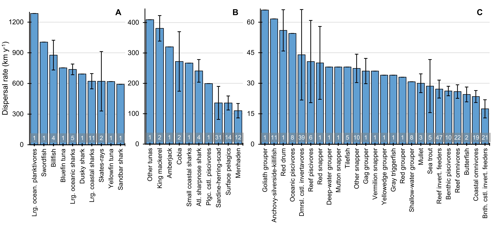
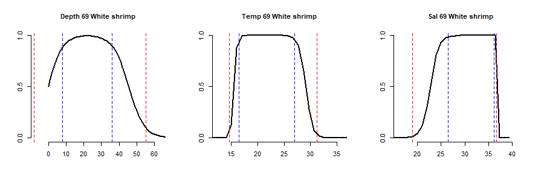

# Data synthesis for a U.S. Gulf of Mexico Spatial Ecosystem Model
This repository represents the data inputs, synthesis, and methods to develop a spatially-explicit U.S. Gulf-wide Ecosystem Model (USGWEM). Our  overarching objective is to support ecosystem-based fisheries management in the Gulf of Mexico (GoM). The USGWEM applies the Ecopath with Ecosim and Ecospace (EwE) software suite to capture trade-offs associated with trophic interactions and fishing dynamics. Each EwE module builds upon the previous ones, offering an increasingly sophisticated and comprehensive toolset for ecosystem-based management and decision-making. 
1. The **Ecopath** model is the foundation of the other two tools by parameterizing an ecosystem foodweb and quantifying the interactions of functional groups (i.e., species, age stanzas for a species, or groups of organisms that share the same function in the food web). The Ecopath model includes diet composition, production, consumption, and biomass for each group.
2. **Ecosim** simulates changes in the Ecopath model over time. The model is fitted to historical timeseries by a routine that alters the vulnerability parameters of predator-prey interactions. Future projections of the fitted model can be used to project responses to management action, fishing, and/or environmental changes.
4. **Ecospace** uses spatially explicit information about habitats, spatial-temporal environmental changes, and dispersal patterns to simulate how changes in the ecosystem (e.g., due to fishing or environmental factors) propagate through time and space. Specifically, Ecosim runs over a matrix of gridded cells to allow functional groups to move between these cells. The speed that groups move between cells is based on dispersal rates for the functional group. The impetus to move will be due to preferences for habitat, environmental drivers, (e.g., temperature, salinity, primary production), and the preferences we set for the functional groups to habitat and environmental drivers. This allows for the prediction of species distribution patterns and the impacts of spatial management measures (like Marine Protected Areas) or environmental changes (like habitat loss).

Our efforts build off of previous work to develop the U.S. Gulf-wide Ecopath with Ecosim model, detailed in [NOAA Technical Memorandum NMFS-SEFSC-751](https://repository.library.noaa.gov/view/noaa/32348), which updated the EwE model developed by [Sagarese et al. (2017)](https://doi.org/10.1016/j.ecolmodel.2016.11.001). The Ecopath food web model includes 78 functional groups, including the following: three marine mammal groups, an aggregate seabird group, an aggregate sea turtle group, and eight elasmobranch groups, 52 fish groups (18 of which are sub-divided into multiple life stages), nine invertebrate groups, three primary producers, and one detritus. Twelve commercial fishing fleets and four recreational fishing fleets are modeled. Trophic interactions were defined according to a meta-analysis of 568 diet studies, many of which were conducted in the GoM. The Ecosim model was calibrated to biomass and catch trends estimated during the period from 1980 to 2016. Time-series of predicted biomass and catch were calibrated to estimates of stock biomass from Southeast Data Assessment and Review (SEDAR), International Commission for the Conservation of Atlantic Tunas (ICCAT), and relative abundance indices calculated from NOAA fisheries independent monitoring programs in the GoM, including the groundfish trawl survey from the Southeast Area Monitoring and Assessment Program (SEAMAP) and the Pelagic Longline Observer Program.

This repository shows our data and synthesis to develop a USGWEM in Ecospace. It's divided into four sections: **dispersal**, **habitat**, **environmental drivers**, and **preference functions**. Data for habitat (static spatial) and environmental drivers (spatially dynamic) represent drivers in the spatially dynamic model. Preference functions define how functional groups respond to these, and dispersal define the rates functional groups can move in the model to find preferred habitats or conditions. 

## 1. [Dispersal rates](https://github.com/SEFSC/IEA-GWEM-DataSynth/tree/main/Ecospace-dispersal-rates)
We show an empirically-derived approach for estimating dispersal rates for Ecospace. First, relative swimming speed is calculated based on the physiological characteristics of a species. Second, relative swimming speeds are scaled to known home ranges for species within the model. In total, dispersal rates were estimated for 325 GoM species and 65 functional groups. Estimated dispersal rates ranged two orders of magnitude from less than 10 km y-1 (three species of Gobiidae) to over 1,000 km y-1 (Basking shark Cetorhinus maximus, Blue marlin Makaira nigricans, and Swordfish Xiphias gladius). The dispersal rate estimates from our approach appear reasonable are largely consistent with the “300-30-3” heuristic. The slowest-moving fish groups had dispersal rates above 15 km per y and generally represented aggregated groups of about 10 to 50 species for small reef demersal fishes. 

Annual dispersal rates for estimated for functional groups of fishes in the Gulf of Mexico Ecosystem Model. Panels A, B, and C are separated by dispersal rate ranges with different corresponding y-axes. Mean values are shown and the number of species per functional group with error bars to indicate confidence intervals of 1.96×SE. The number of species in a given functional group is indicated by the number at the base of the plot. 
## 2. [Depth and habitat maps](https://github.com/SEFSC/IEA-GWEM-DataSynth/blob/main/Ecospace-habitat-maps/README-Make-depth-and-habitat-maps.md)
The script to make the base/depthmap for Ecospace fetches bathymetric data from the NOAA server, converts it into rasters, and generates depth maps with different grid-cell resolutions. The bounding box and resolutions are parameters that can be customized to fit different regions and scale requirements. For the USGWEM Ecospace, we use 08 minute resolution and a maximum depth of 400 m, making all cells over 400m deep equal to 400m.

Scaled hardbottom maps are developed from the rasters identifying distances to artificial reefs and natural hardbottom. We make habitat maps for Ecopsace by taking the inverse distance. Specifically, proxy distances to ARs are taken as the inverse distance and proxy distances to natural hardbottom use the inverse squared distance. This estimates a faster habitat decline from artificial reef and a longer, more gradual decline away from a natural reef area.

Lastly, we use data collated by the [NOAA Gulf of Mexico Data Atlas](https://www.ncei.noaa.gov/products/gulf-mexico-data-atlas) to generate habitat maps for **rock**, **gravel**, **sand**, **mud**, **coral**, and **seagrasses**. 

## 3. [Spatial-temporal environmental drivers](https://github.com/SEFSC/IEA-GWEM-DataSynth/tree/main/Ecospace-environmental-drivers)
The USGWEM uses monthly spatial-temporal files for nutrients, temperature, and salinity to help model environmental impacts on marine ecosystems. These impacts may result from changes in temperature, precipitation, and circulation patterns due to climate change. The environmental variables include:
- Chlorophyll-A (Chl-A) Concentration: This is an indicator of phytoplankton biomass and helps determine nutrient availability.
- Sea Temperature: This influences species distribution, behavior, and biological processes rates.
- Salinity: This influences species' spatial distribution based on their physiological responses.

Data for these variables are collected via MODIS (a satellite-based sensor providing oceanographic data) and HYCOM (a numerical ocean model simulating and forecasting various oceanographic variables). These data sources help generate monthly spatial-temporal files from 1980 to past 2016. To address the lack of data prior to the starting years of MODIS (2003) and HYCOM (1993), monthly averages calculated from the entire available data set are used.

## 4. [Preference functions](https://github.com/SEFSC/IEA-GWEM-DataSynth/tree/main/Ecospace-preference-functions)
This code queries the Aquamaps database and, with further processing, we generate environmental preference functions for the Gulf-wide Ecospace Model. Data to make these preference functions comes from the [AquaMaps](https://www.aquamaps.org/main/AboutAquaMaps.php), a tool for generating model-based, large-scale predictions of natural occurrences of species. Preferences for each environmental driver are parameterized with values for absolute and preferred minima and maxima from AquaMaps: 
1. Minabs  = absolute minimum in extracted data or 25th percentile - 1.5 × interquartile (whichever is lesser)
2. Minpref = 10th percentile of observed variation in an environmental predictor
3. Maxpref = 90th percentile of observed variation in an environmental predictor
4. Maxabs  = absolute maximum in extracted data or 75th percentile + 1.5 × interquartile (whichever is greater)

For the USGWEM, we develop environmental preference functions for **depth**, **temperature**, and **salinity**. Our code essentially follows four steps:
1. Query environmental preferences from FishBase R
2. Aggregate by species and functional group
3. Review and adjust based on expert opinion
4. Apply a double-logistic function to all groups to make a preference envelope

## Notice
This repository is a **scientific product** and is **not** official communication of the National Oceanic and Atmospheric Administration, or the United States Department of Commerce. All NOAA GitHub project code is provided on an ‘as is’ basis and the user assumes responsibility for its use. Any claims against the Department of Commerce or Department of Commerce bureaus stemming from the use of this GitHub project will be governed by all applicable Federal law. Any reference to specific commercial products, processes, or services by service mark, trademark, manufacturer, or otherwise, does not constitute or imply their endorsement, recommendation or favoring by the Department of Commerce. The Department of Commerce seal and logo, or the seal and logo of a DOC bureau, shall not be used in any manner to imply endorsement of any commercial product or activity by DOC or the United States Government.
